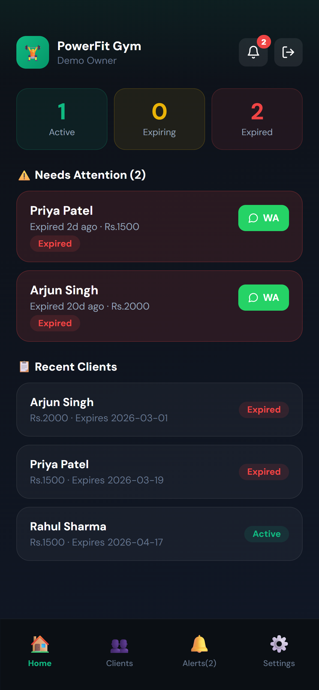
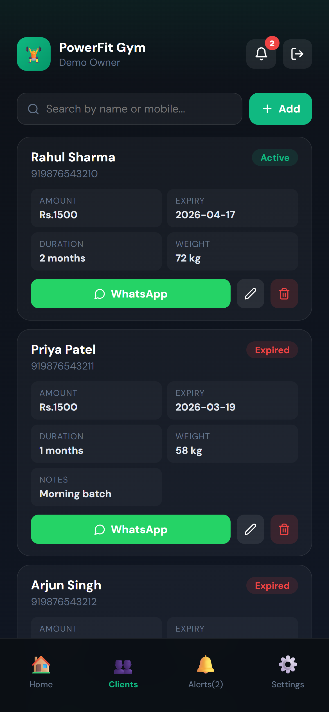
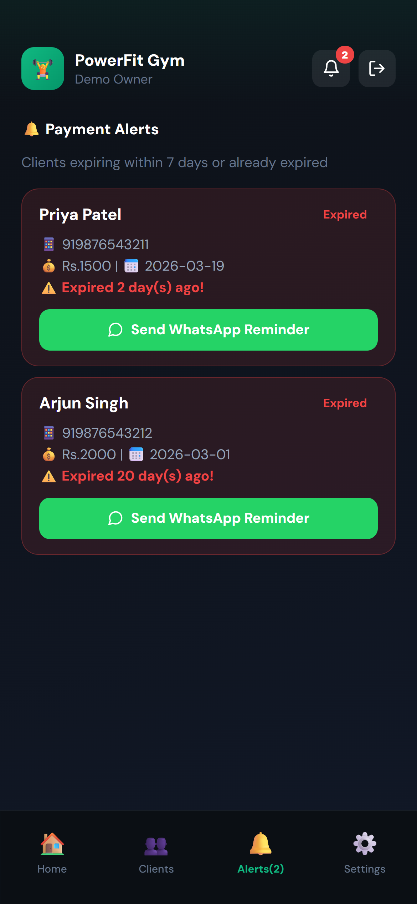
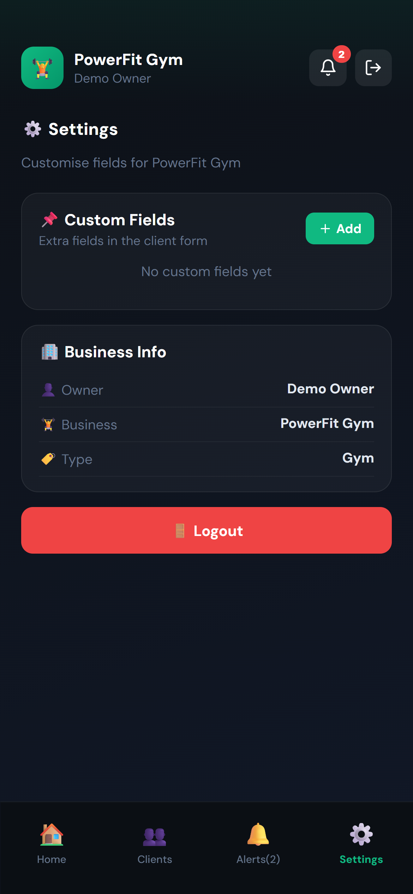

<div align="center">


<br/>

<a href="https://renew-desk.vercel.app/">
  
</a>

<br/><br/>

[](https://renew-desk.vercel.app/)
[](https://react.dev/)
[](https://vitejs.dev/)
[](https://vercel.com/)
[](LICENSE)

<br/>

> 🔗 **[https://renew-desk.vercel.app/](https://renew-desk.vercel.app/)**
>
> Demo login — **Business:** `PowerFit Gym` &nbsp;·&nbsp; **PIN:** `1234`

</div>

---

## 📸 Preview

<!-- Replace the images below with your own screenshots -->

<table>
  <tr>
    <td align="center">
      
      <br/><b>Dashboard</b>
    </td>
    <td align="center">
      
      <br/><b>Clients</b>
    </td>
    <td align="center">
      
      <br/><b>Alerts</b>
    </td>
    <td align="center">
      
      <br/><b>Settings</b>
    </td>
  </tr>
</table>

---

## ✨ Features

- 🏢 **Multi-business support** — Gym, PG/Hostel, Coaching, Sports Club
- 👥 **Client management** — Add, edit, delete with smart business-specific fields
- 🔔 **Expiry alerts** — Auto-flags clients expiring within 7 days or already expired
- 💬 **WhatsApp reminders** — One-tap pre-filled messages with optional personal notes
- 🎉 **Welcome messages** — Auto-send a welcome summary when a new client is added
- 📌 **Custom fields** — Add any extra fields (text / number) to your client form
- ⚙️ **Settings panel** — Manage course lists (coaching) and sport lists (club)
- 🔐 **Multi-owner login** — PIN-protected accounts, each business has its own data

---

## 🏢 Business Types

| Business | Extra Fields |
|---|---|
| 🏋️ Gym / Fitness | Weight (kg) |
| 🏠 PG / Hostel | Room No · Advance · Maintenance · Parking · Water Bill |
| 📚 Coaching / Tuition | Course — from your managed course list |
| 🎾 Sports Club | Sport — from your managed sports list |
| 🏢 Other | Custom fields only |

> All types support **unlimited custom fields** via the ⚙️ Settings tab.

---

## ⚡ Getting Started

```bash
# Clone the repo
git clone https://github.com/YOUR_USERNAME/renewdesk.git
cd renewdesk

# Install dependencies
npm install

# Start dev server
npm run dev
```

Open **http://localhost:5173** in your browser.

| Command | Description |
|---|---|
| `npm run dev` | Start local development server |
| `npm run build` | Build for production |
| `npm run preview` | Preview production build locally |

---

## ☁️ Deploy to Vercel

```bash
# Push to GitHub first
git init
git add .
git commit -m "feat: RenewDesk v1.0"
git remote add origin https://github.com/YOUR_USERNAME/renewdesk.git
git branch -M main
git push -u origin main
```

Then go to [vercel.com](https://vercel.com) → **Add New Project** → select your repo → click **Deploy**. Done in 60 seconds. ✅

Every `git push` auto-redeploys. 🚀

---

## 🛠 Tech Stack

```
React 18 · Vite 5 · lucide-react · WhatsApp deep links · Vercel
```

---

## 📄 License

MIT © [Your Name](https://github.com/YOUR_USERNAME)

---

<div align="center">


⭐ **Star this repo if it helped you!**

[](https://github.com/YOUR_USERNAME/renewdesk)
[](https://renew-desk.vercel.app/)

</div>